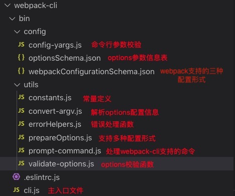
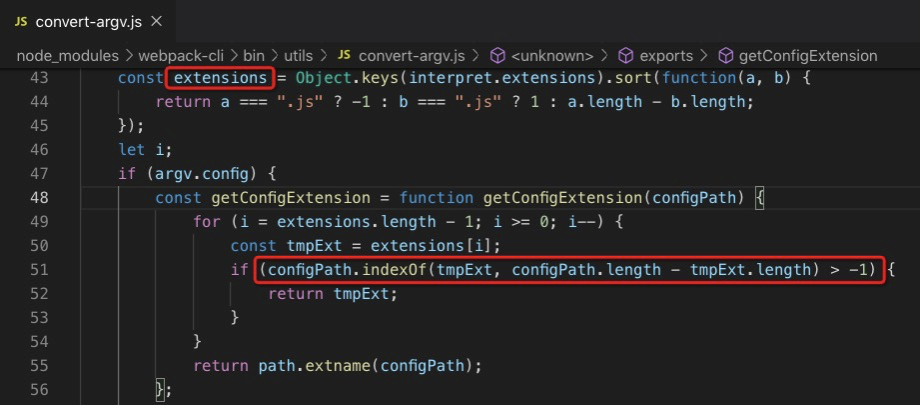
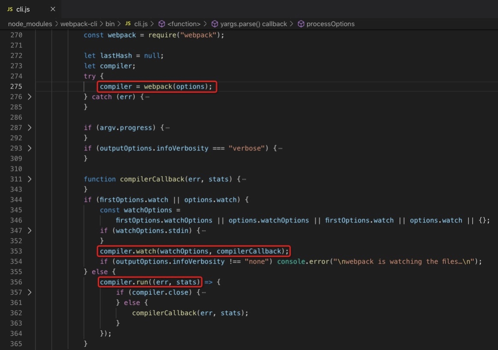

# 准备工作

## 摘要
这一节，属于webpack启动的前奏部分。其实webpack本质是一个工具，这个工具的内部体系其实非常庞大复杂，它在支持高度可配置的同时（可使用自定义的打包方式及loader和plugin），又做到了开箱即用（我们在使用webpack的时候几乎可以什么都不配置）。
如果我们自己写一个工具，我们会怎么开启用户的使用之旅，怎么引导用户去进行正确的配置和使用，怎么收集用户的配置，怎么判断用户输入的配置符合规范，怎么去友好提示用户进行正确配置，怎么设置默认配置。。。 这一章，我们来看看webpack是怎么做的。

## 命令行脚本
一切开始于webpack的安装，执行'npm install webpack'之后，找到node_modules下的webpack，在package.json里边，注意两个属性："main"和"bin"，前者是模块的主入口文件，我们在项目里边reqire('webpack')时，引入的其实就是main属性所指向的文件，后者是可执行的node脚本，我们在控制台执行'npm run webpack'的时候，执行的就是这个文件。

在这个可执行文件里边，主要做了一件事，获取webpack的CLI工具包并执行，有两个选择供我们安装，官方更推荐webpack-cli，webpack-command已经不再维护（webpack4版本以前，webpack和webpack-cli是放在一起的）。

这个脚本里边，作者使用了node提供的require模块，通过在一个try...catch语句里执行require.resolve('模块名')，来判断是否安装了CLI包；通过判断本地是否存在yarn.lock文件来判断是否使用的yarn；使用child_process模块执行命令；使用readline模块获取用户输入的命令。
不过这个地方有一个可优化的小点，就是在提示用户未安装CLI工具时，是通过遍历数组CLIs，判断数组对象的recommended字段，然而在真正安装包的时候，用的是通过写死的包名webpack-cli。这可能会导致以后无论如何修改对象的recommended属性，安装的都是webpack-cli。

## webpack-cli

我们在摘要里边最后提的几个问题，答案都在webpack-cli里边。
webpack-cli本身提供了几个命令任务：init、info、server、migrate等，输入不同的命令（eg. webpack-cli init），都会触发判断、安装、执行相应模块的操作，具体步骤跟webpack的命令行脚本差不多。我们看下包里的文件：

### 第一阶段 options获取
配置参数的获取，主要依赖yargs模块，它主要用来管理命令行参数。

1. 定义一个options数组，用来存放收集到的配置数据，这些数据包括webpack运行的所有配置信息，相当于是启动webpack的一把钥匙；
2. 确定配置渠道，webpack-cli支持从命令行输入文件地址或者通过本地文件进行配置，前者直接拿到文件的路径；后者通过正则匹配，使用find-sync模块同步地查找本地配置文件，来配置文件路径。这里有一个技巧，由于webpack支持不同语言的配置，因此就需要处理获取文件的格式并引入相应的loader（此处使用了interpret模块），文件格式有几十种，代码先将文件格式按长度由短到长进行排序，将'.js'排在第一位，因为大部分还是js文件，这样在遍历查找的时候往往第一步就可以查到返回，大大提升了效率，且indexOf第二个参数传的很巧妙，如图：
3. require配置文件并收集（而不是解析）配置数据，因为webpack支持多种配置类型，比如导出一个函数、一个Promise、一个或多个多个配置对象等，此时，所有的配置数据收集完毕；
第四步，获取最终的标准配置对象，拿到配置数据后，先进行校验，配置字段不符合规范的话，会提示报错信息并终止程序，校验函数是webpack提供的（依赖Ajv模块）；其次，解析配置数据，通过一系列的函数处理，将webpack需要的配置字段依次地写入options，同时做一些默认处理，比如设置默认的main入口；一些特定模式的配置会对应一些插件，它会默认去添加这些插件，比如配置热更新模式的话会会默认在plugins里边添加HotModuleReplacementPlugin插件；最后，根据命令行输入的其他参数，继续丰富options对象，比如我们常用的监听模式，就会将options.watch设置为true。

### 第二阶段 启动webpack
经过第一阶段，启动webpack的这把"钥匙"就打造好了。
1. 确定输出信息。输入信息有了，那么输出的bundle信息呢，我们可以给stats一个字符串，去指定任意一种模式（webpack提供了6种输出模式），或给stats一个对象，去更细粒度地控制是否要展示某一个特定的字段；
2. 实例化webpack并传入options对象，赋给compiler，这个compiler就是webpack的化身了，掌控者webpack执行整个的生命周期。根据用户自定义的配置，决定如何监控编译进度，从而在compiler对象提供的钩子上订阅一些事件。同时定义了一个lastHash变量，它存储的是每一轮webpack编译对应的hash值，只有当这个值变化的时候才会执行一些操作，这样就避免了浪费，同时，如果是非监听模式，在compiler.close()的回调里边会清除缓存。最后，根据配置情况，去执行compiler.watch() 或者 compiler.run()。至此，初始化工作就差不多完成了，剩下的交给了webpack模块。这个第二步，都汇聚在这张图：

## 总结
在看源码的时候，自己对webpack-cli有了更深入的认识，也发现了webpack-cli更多的配置特性。另外，不得不说的是webpack完善的代码体系，包括控制台日志的打印、报错信息的输出规范，都有系统地封装。

