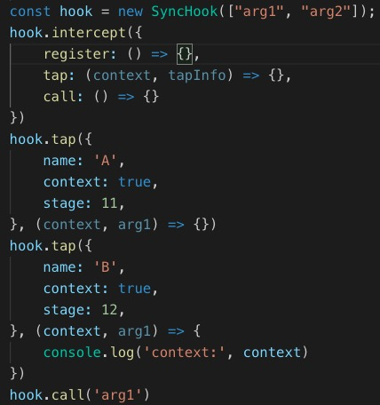
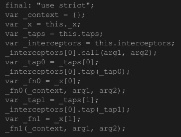
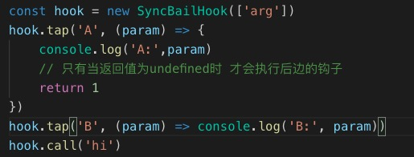
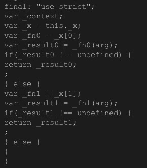
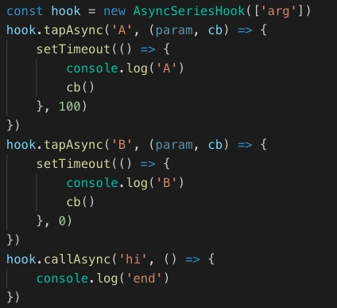
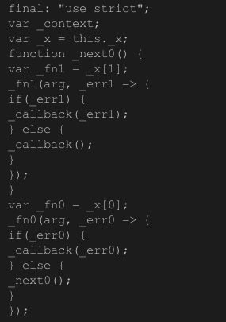

# webpack事件流之Tapable
## 摘要
上一章我们有提到webpack支持特定的配置，来监控其编译进度，那么这个机制是怎么实现的呢？
webpack整个构建周期，会涉及很多个阶段，每个阶段都对应着一些节点，这些节点就是我们常说的钩子，每一个钩子上挂载着一些插件，可以说整个webpack生态系统是由一系列的插件组成的。当主构建流程进行编译打包的时候，会陆续触发一些钩子的call方法（相当于emitter），相应的插件（相当于listener）就会得到执行，webpack将这个机制封装为一个库，就是[Tapable](https://webpack.docschina.org/api/tapable/)，webpack的核心对象Compiler和Complation均是Tapable的实例。

## 特性
Tapable提供了很多类型的hook，主要分为两大类：同步和异步，异步又分为串行（前一个异步执行完才会执行下一个）和并行（等待所有并发的异步事件执行完之后才会执行最后的回调）。在webpack里边（Compiler和Compilation）主要使用了SyncHook、SyncBailHook、AsyncSeriesHook三种钩子，因此这里我们只着重介绍这三种。

我们参考的版本是webpack中使用的版本v1.1.3，这里有个[Tapable的源码注释版](https://github.com/magic-dm/digest-tapable)，主要是Hook.js、SyncHook.js、HookCodeFactory.js三个文件，可以供大家参考。

源码里边，每一个文件对应一个类型的钩子。每一种钩子都是基于Hook和HookCodeFactory两个类。
* Hook基类主要收集并处理挂载在钩子上的taps以及interceptors
* HookCodeFactory基类根据前者返回的options生成执行钩子的代码


## 实现
#### 1. SyncHook
**SyncHook的初始化及钩子函数的函数体**
   1. 初始化：

   2. 钩子执行的源码：


**SyncHook的伪代码及使用**
```js
class SyncHook{
    constructor(arg) {
        if (Array.isArray(arg)) {
            this.args = arg
        } else {
            this.args = [arg]
        }
        this.funs = []
        this.taps = []
        this.interceptors = []
    }

    intercept(interceptor) {
        this.interceptors.push(Object.assign({}, interceptor))

        // 如果有多个register拦截器 总是以最后一个拦截器为准
        if (interceptor.register) {

            // 所有Tap对象依赖于register函数的返回值
            for(let i in this.taps) {
                this.taps[i] = interceptor.register(this.taps[i])
            }
        }
    }

    tap(option, fn) {
        if (typeof option === 'string') {
            option = { name: option }
        }
        if (typeof option !== 'object' || option === null) {
            throw new Error("Invalid arguments to tap(options: Object, fn: function)");
        }
        option = Object.assign({ type: "sync", fn: fn }, option);
        if (typeof option.name !== 'string' || option.name === '') {
            throw new Error("Missing name for tap");
        }
        option = this._putInterceptor(option)
        this.taps.push(option)

        // 根据stage属性进行排序 决定taps的触发顺序
        if (this.taps.length > 1) {
            this.taps = this._sort(this.taps)
        }

        this.funs = this.taps.map(item => item.fn)
    }

    call(...args) {
        // 以初始化钩子时传入的参数长度为准，多余的参数无效
        const _args = args.slice(0, this.args.length)

        for(let i in this.funs) {
            const curTap = this.taps[i]
            const curFun = this.funs[i]

            // 根据Tap对象的属性 决定是否要传入上下文
            if (curTap.context) {
                curFun.call(this, curTap, ..._args)
            } else {
                curFun.call(this, ..._args)
            }
        }
    }

    _putInterceptor(option) {
        // 若tap的时候已经存在拦截器 则替换Tap对象
        for(let interceptor of this.interceptors) {
            if (interceptor.register) {
                const newOption = interceptor.register(option)
                if (!newOption) {
                    option = newOption
                }
            }
        }
        return option
    }

    _sort(taps) {
        return taps.sort((cur, next) => cur.stage - next.stage)
    }
}

// 使用
const hook = new SyncHook(["arg1",'arg2']);
hook.intercept({
    register: (tap) => {
        tap.name = 'changed'
        return tap
    },
})
hook.tap({
    name: 'A',
    context: true,
    stage: 22,
}, (context, arg1) => {
    console.log('A:', arg1)
})
hook.call('arg1', 'arg2')
```

#### 2. SyncBailHook
**SyncBailHook的初始化及钩子函数的函数体**
   1. 初始化：

   2. 钩子执行的源码：


**SyncBailHook的伪代码**
```js
// 只需要在SyncHook的基础上改动一下call方法
class SyncBailHook() {
    // some code...

    call(...args) {
        // 以初始化钩子时传入的参数长度为准，多余的参数无效
        const _args = args.slice(0, this.args.length)
        let ret

        for(let i in this.funs) {
            if (ret !== undefined) {
                break
            } else {
                const curTap = this.taps[i]
                const curFun = this.funs[i]
    
                // 根据Tap对象的属性 决定是否要传入上下文
                if (curTap.context) {
                    ret = curFun.call(this, curTap, ..._args)
                } else {
                    ret = curFun.call(this, ..._args)
                }
            }
        }
    }

    // some code...
}

const hook = new SyncBailHook(['arg'])
hook.tap('A', (param) => {
    console.log('A:',param)
    // 只有当返回值为undefined时 才会执行后边的钩子
    return 1
})
hook.tap('B', (param) => console.log('B:', param))
hook.call('hi')
```


#### 3. AsyncSeriesHook
**AsyncSeriesHook的初始化及钩子函数的函数体**
   1. 初始化：

   2. 钩子执行的源码：


**AsyncSeriesHook的伪代码**
```js
// 只需在SyncHook的基础上新增两个方法
class AsyncSeriesHook{
    // some code ... 

    // 同tap方法
    tapAsync(option, fn) {
        // some code ...
    }

    callAsync(...args) {
        const finalCb = args.pop()
        let index = 0
        let next = () => {
            if (this.funs.length == index) {
                return finalCb()
            }
            let curFun = this.funs[index++]
            curFun(...args, next)
        }
        next()
    }

    // some code ... 
}

const hook = new AsyncSeriesHook(['arg'])
hook.tapAsync('A', (param, cb) => {
    setTimeout(() => {
        console.log('A', param)
        cb() // 必须调用cb 才会执行后续的钩子
    }, 1000)
})
hook.tapAsync('B', (param, cb) => {
    setTimeout(() => {
        console.log('B')
        cb()
    }, 0)
})
hook.callAsync('hi', () => {
    console.log('end')
})

```

