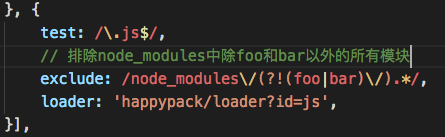
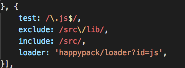
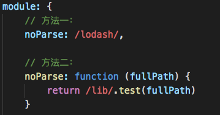
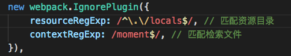
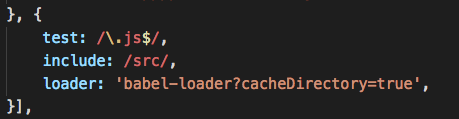
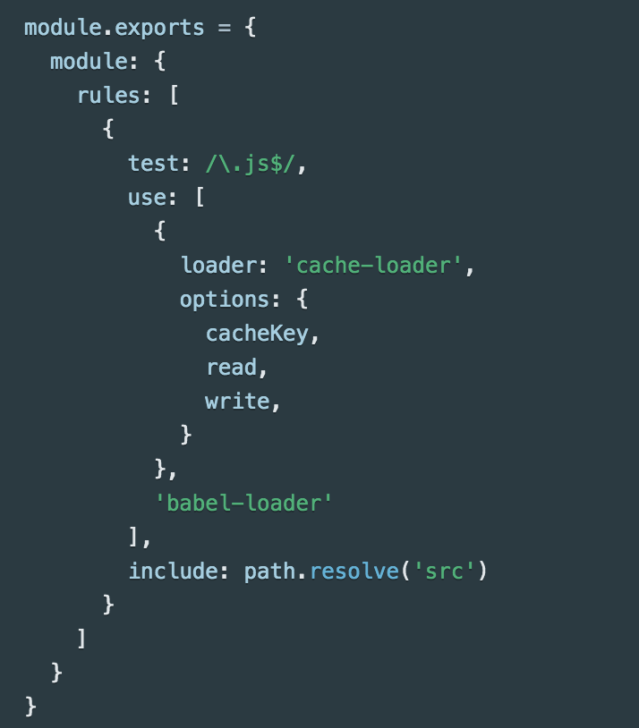
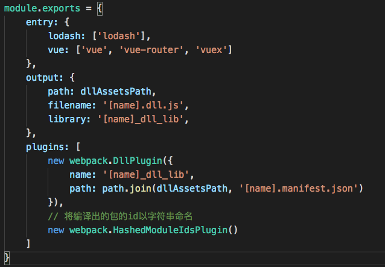
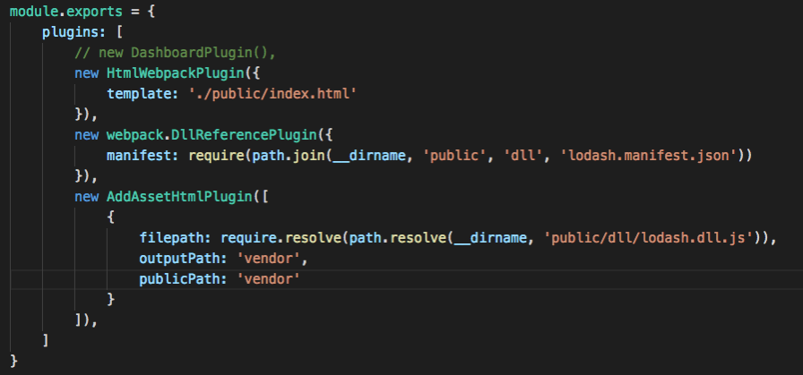
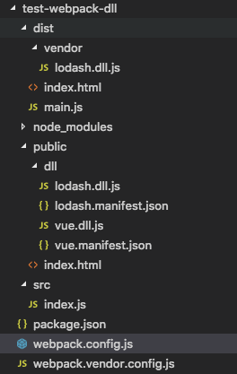
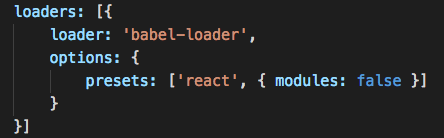

# webpack之打包性能优化

当项目发展到一定规模之后，性能问题就随之而来，本文主要介绍了一些webpack的配置方法，使得打包速度更快，输出的资源更小，主要包括：

    1. 多线程打包与HappyPack
    2. 缩小打包作用域
    3. 动态链接库与DllPlugin
    4. 死代码检测与tree shaking

## HappyPack
#### 工作原理
在打包中有一项非常耗时的工作，就是loader对资源的转译工作，主要包括以下几个步骤：

    1. 获取打包入口
    2. 配置loader规则，对入口模块进行转译
    3. 对转译后的模块进行依赖查找
    4. 对查找到的模块重复步骤2和3，直到没有依赖的模块

由此，我们知道步骤2～4是个递归的过程，这里的问题是webpack是单线程的，虽然这些转译任务彼此之间没有依赖，却必须串行地执行。HappyPack的切入点就是，他可以开启多线程，并行地对不同模块进行转译，可以充分地利用本地计算资源来提高打包速度。
HappyPack适用于转译任务比较重的打包工作，如babel-loader对ES6的转译、ts-loader对TypeScript的转译。

## 缩小打包作用域
#### exclude和include（确定loader的规则范围）
我们在配置loader的时候，一般应该把node_mdules目录排除掉，当include、exclude有重叠时，exclude优先级更高。
下边的例子仅对node_modules中的某个包起作用：

下边的例子是对include中的目录进行排除：

#### noParse（不解析仍打包）
有些库我们不希望webpack去应用任何loader规则，也不需要解析，库的内部也不会对其他模块进行依赖，那么我们可以使用noParse对其进行排除。

#### IgnorePlugin（即便引用也不打包）
用于排除一些库引用的其他额外的资源，比如Moment.js库会加载很多其他地区的语言包，通常这些包会占用很多体积，但我们却用不到，此时可以用IgnorePlugin去掉。

#### Cache
一些loader会有cache配置项，用于在编译后保存一份代码的缓存，在执行下一次编译前会检查源文件是否有改变，若没有，就直接采用缓存，这样实际上编译的只有改变了的文件，这在一定程度上可以提高打包速度。
案例一：

案例二：

## 动态链接库与DllPlugin
DllPlugin采用类似于动态链接库的方式，将低频改动的库进行一次编译打包，之后可多次使用，从而提升打包速度。
#### DllPlugin配置
1、webpack.vendor.config.js的配置：

2、webpack.config.js的配置：

3、最终生成文件的目录：

## tree shaking
tree shaking只能对ES6 Modules生效，因为ES6的依赖查找是在编译时而非运行时，有时候我们虽然只用了库中的某一个接口，整个库都会被打包进来，这可能是由于这个库是用CommonJS的方式导出的。
一个模块可能会导出多个API，并不是每个方法我们在项目中都会用到，那些没有被用到的方法不应该被打包进来，webpack4.0已经默认帮我们删掉了这些死代码，只需要将mode设置为production模式即可。
若工程中使用了babel-loader，则要禁用他的模块依赖解析，因为他转化过的都是CommonJS形式的模块，导致无法利用tree shaking特性。

总之，提升性能的方式无非就是两种：缩小打包作用域、增加资源。增加资源就是使用更多的CPU和内存，充分利用计算能力，缩小范围就是去掉冗余的流程及重复性的工作。
(参考书籍：《webpack实战：入门、进阶与调优》)

# webpack之前端代码优化