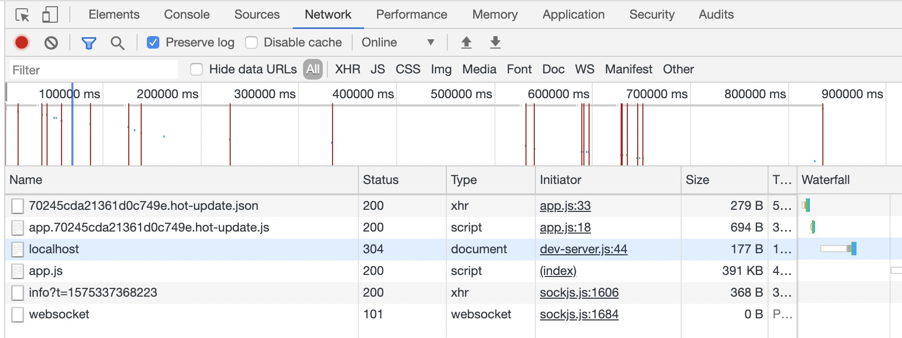

# 热更新原理

## 概念
根据[官网](https://www.webpackjs.com/guides/hot-module-replacement/)的理解，HMR是指程序在运行过程中替换、删除、添加模块，而无需重新加载整个页面，从而提高开发速度，优化开发体验（只适用于开发环境）。webpack-dev-server还提供了一些[API](https://www.webpackjs.com/api/hot-module-replacement/)，用来进行一些自定义配置，比如哪些模块的变化强制刷新页面，哪些模块变化不刷新页面而是走热更新，实际开发中很少需要自定义配置，因此我们这里重点介绍原理。

## 使用
webpack.config.js
```js
const webpack = require('webpack')
const HtmlWebpackPlugin = require('html-webpack-plugin');

module.exports = {
    mode: 'development',
    entry: {
        'app': path.resolve(__dirname, './index.js'),
    },
    devServer: {
        hot: true,
    },
    plugins: [
        new HtmlWebpackPlugin(),
        new webpack.HotModuleReplacementPlugin()
    ]
}
```
package.json
```json
{
    //...
    "scripts": {
        "start": "webpack-dev-server"
    },
    "dependencies": {
        "webpack": "^4.41.2"
    },
    "devDependencies": {
        "html-webpack-plugin": "^3.2.0",
        "webpack-dev-server": "^3.9.0"
    }
    //...
}
```
npm run start启动服务，改变index.js文件，ctrl+s，就能看到热更新效果，在控制台也能看到热更新相关的请求。


## 原理
我们可以先设想一下，webpack是怎么实现热更新的，实现热更新需要什么条件。首先肯定要知道模块发生了改变，然后浏览器通过某种方式拿到改变了的模块chunk，再去替换掉老的模块chunk，由于模块在编译后已经面目全非，很难辨认，所以知道模块的映射位置信息。热更新功能的实现主要依赖两个模块：webpack-dev-server、webpack-dev-middleware。

#### WebSocket
先来看下基础能力 —— 浏览器与服务器端的通信，这是通过[WebSocket](http://www.ruanyifeng.com/blog/2017/05/websocket.html)来实现的，他最大的特点就是服务端可以主动向客户端推送消息，优势是没有同源限制、数据量小、性能高。

**简单看一个例子**
服务端：main.js
```js

const path = require('path')
const express = require('express')
const WebSocket = require('ws')
const { createServer } = require('http')

const app = express()
app.use(express.static(path.join(__dirname, '/')));

const server = createServer(app)
const wss = new WebSocket.Server({ server })

wss.on('connection', (ws) => {
    console.log('server opened')
    ws.send('hi from server...')
    ws.on('close', () => {
        console.log('server stoped')
    });
    ws.on('message', (data) => {
        console.log(data);
    })
})
server.listen('8888', () => {
    console.log('Listening on http://localhost:8888')
})

```
客户端：index.html
```html
<div class="box">home page</div>
<script>
    const boxEle = document.querySelector('.box')
    const ws = new WebSocket(`ws://${location.host}`)
    ws.onmessage = (event) => {
        console.log('client:', event.data);
        ws.send('hi from client...')
        ws.close()
    }
</script>
```
(main.js与index.html置于同一文件夹下，打开控制台在当前目录下执行node main.js，即可启动服务)


#### webpack-dev-middleware
已监听模式启动webpack，将webpack编译好的文件输出到缓存中，从而提高了构建速度，这是与直接调用webpack的watch方法最大的区别。底层使用memory-fs替换了webpack的outputFileSystem属性。


#### WDS
启动webpack-dev-server后，调用lib下webpack-dev-server.js文件，在这个里边我们能看到他主要做了三件事：
1. 获取config及options对象
    config是启动webpack所需参数，获取配置对象这块底层调用的还是webpack-cli里边的模块，我们之前第一章有了解过。通过config对象获取启动Server所需的参数options，这个options对象也就是我们在webpack.config.js里边传入的devServer属性，然后加了一些默认项，是启动后端服务需要的配置信息。
2. 实例化webpack
3. 获取Server实例（传入options和compiler），并调用实例的listen方法启动服务
    
**Server.js**
重点来看下实例化Server这个动作。在Server.js里边，有以下几个关键动作：
1. 在compiler上挂载钩子
2. 使用的express及http模块创建服务并进行路由配置
3. 启动webpack-dev-middleware
4. 创建Server（使用sockjs或ws模块）


